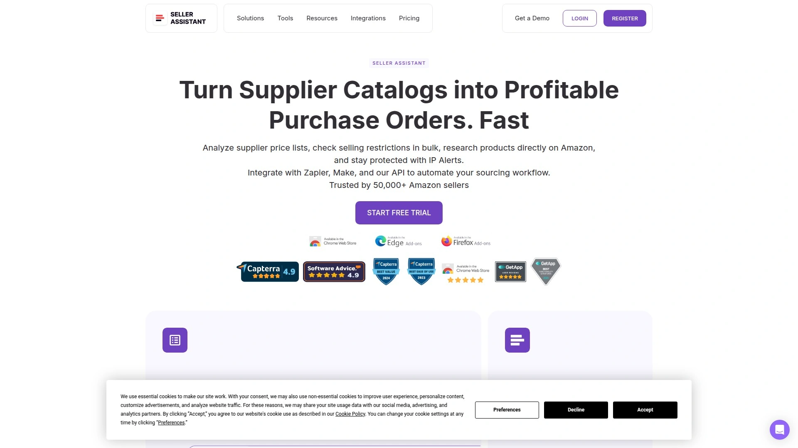
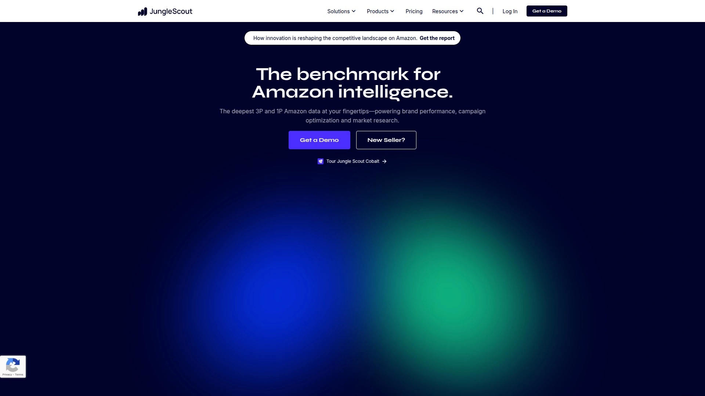
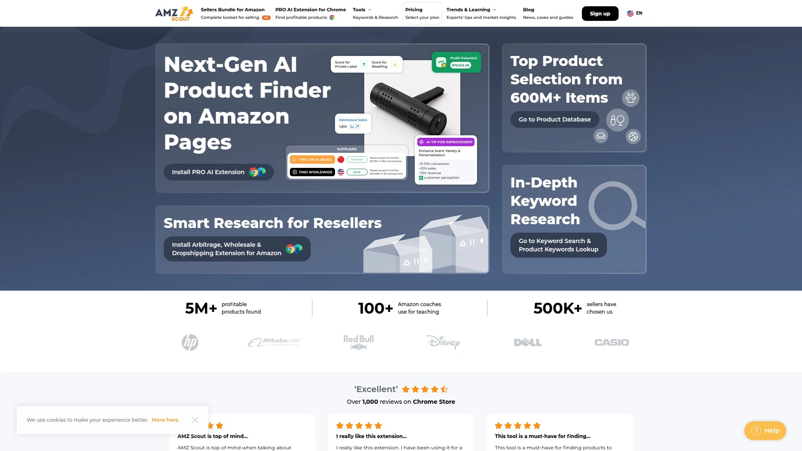
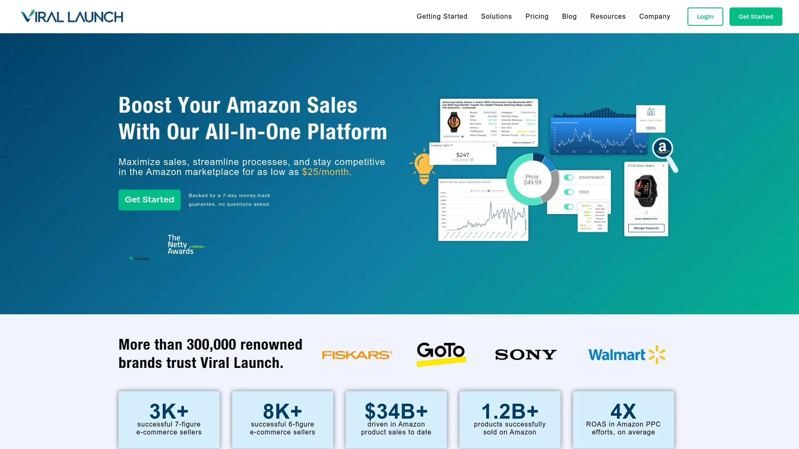
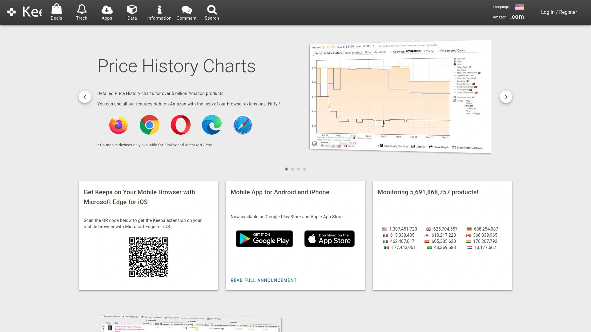

# 7家全球最佳亚马逊选品工具（批发&套利工具）

亚马逊卖家在海量商品中精准选品常常面临效率低、利润难核算等痛点，**亚马逊选品工具**可帮助节省时间、提升利润率。通过集成**FBA计算器**、库存监控与IP警报等功能，迅速锁定高潜力SKU，减少风险并一键导出数据。以下汇总全球最受欢迎的7款工具，覆盖批发、套利与品牌卖家必备场景。

## [Seller Assistant](https://www.sellerassistant.app)
一站式选品神器，整合利润计算与风险预警，适合跨境批发套利。

- 核心功能：FBM/FBA利润计算器、IP警报、快速查看、库存检查器
- 特色场景：实时Side Panel对比供应商与亚马逊价格，快速筛选高毛利产品
- 上手体验：Chrome扩展即装即用，无需额外账号注册；支持14天免费试用
- 团队协作：可创建子账号，方便VA分工，不影响主账号权限

## [Helium 10](https://www.helium10.com)
超30款亚马逊工具套件，覆盖选品、关键词与运营全流程。

- 产品亮点：多渠道关键词研究、Listing优化、广告与PPC管理
- 目标用户：成长型品牌与月销百万级卖家，追求数据化运营的优选
- 定价模式：按工具模块付费，支持月度与年度订阅，可自定义组合
- 技术优势：深度数据驱动，支持Walmart与TikTok Shop拓展

## [Jungle Scout](https://www.junglescout.com)
领先的选品与市场调研平台，助力新手卖家快速验证产品潜力。

- 关键功能：销售估算、趋势分析、批量供应商列表导入与限制检查
- 使用场景：线上套利、新品爆款研发及跨站点市场对比
- 上手易用：图形化界面、Chrome扩展结合桌面端一体化工作流
- 支持服务：会员专属折扣码与内容推送，持续提升转化率

## [AMZScout](https://amzscout.net)
AI驱动的选品工具，擅长历史数据追踪与实时趋势洞察。

- 核心特色：30%佣金？（示例产品）*此处不展示佣金细节*；30天Cookie跟踪
- 产品功能：销售估算、竞争对手监控、Chrome扩展与Web App双端支持
- 推荐理由：适合细分市场深度挖掘，算法准确率高，数据更新及时

## [Viral Launch](https://viral-launch.com)
全流程电商运营平台，结合选品、关键词与广告优化于一体。

- 主要模块：产品研究、竞争追踪、关键词研究、PPC管理与跟踪
- 平台卖点：AI洞察+海量数据支撑，覆盖80亿美元销售额数据集
- 定价方案：入门级$69/月起，成长型$99/月及企业级$199/月，满足不同需求

## [Keepa](https://keepa.com)
专业价格追踪工具，提供全面的历史价格与排名走势图表。

- 功能亮点：多区域价格历史、最低/最高价监控、库存提醒与价格警报
- 使用方式：安装浏览器插件后即刻在商品详情页查看图表，无需离开亚马逊
- 适用人群：想要精准把握价格波动、优化采购与定价策略的卖家

## [Sellics](https://www.selllics.com)
一体化运营与广告优化平台，专注提升PPC效果与利润。
- 广告洞察：整合PPC与有机数据，精准定位关键词投放策略
- 核心功能：利润分析、库存预警、竞品监控与客户反馈管理
- 版本区分：Seller Edition与Vendor Edition对应不同账号类型，高可定制化

***

### 常见问题

Q: 如何快速上手Seller Assistant？
A: 安装Chrome扩展后，在商品和搜索页侧边自动加载数据，无需额外登录。

Q: 哪款工具支持批量ASIN限制检查？
A: Seller Assistant与Jungle Scout均提供批量限制检查功能，支持5,000+ ASIN同时检测。

Q: 如何评估选品工具的ROI？
A: 通过对比FBA利润计算器结果与实际上架成本，结合历史销售估算判断投资回报。

***

总结：以上7款工具均可**显著提升选品效率与利润可视化**，第1名[Seller Assistant](https://www.sellerassistant.app) 适合追求自动化批发套利的卖家场景，轻松整合成本计算与风险预警，助力决策更稳健。
